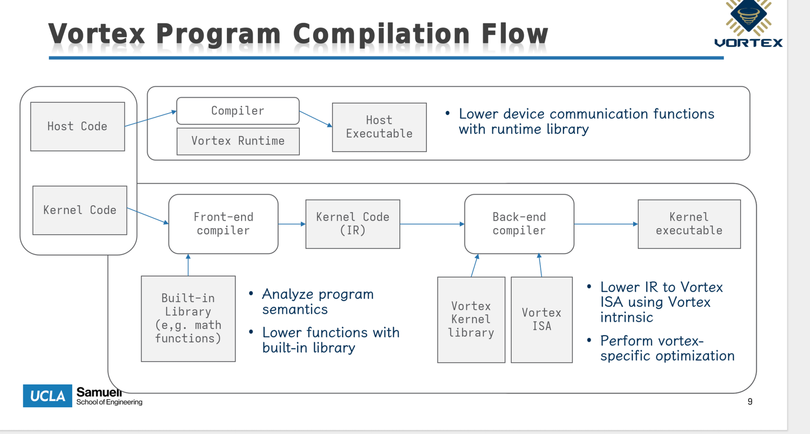

# GPU 进阶（二）接入 Vortex

!!! note "主要贡献者"

    - 作者：[@caspian](https://github.com/trace1729)

---

> 背景介绍 & 专业阶段 见 CPU 方向

根据实验要求，我们需要

- 将之前手写的 c model 替换为 vortex 项目下的 simx 模拟器；
- 将之前写的 gpgpu driver 和 vortex 的 pocl 运行时对齐；
  - vortex 在 bar2 空间中预期的数据格式与我们之前自己拍脑袋设置的，可能不一样
- 编译 vortex/tests/opencl/sgemm，并运行在 arceos + qemu + simx 中。

为了兼容 vortex, 我们首先需要了解 vortex 软件栈的设计哲学。可以参考官方教程 [vortex tutorial](https://github.com/vortexgpgpu/vortex_tutorials) 进行学习。

## vortex 软件栈介绍

vortex 是一个开源的 RISC-V GPGPU 硬件/软件项目，包含 RTL，仿真器，支持 OpenCL 和 CUDA。为了理解 vortex 软件栈的搭建，我们可以回顾在 arceos 实现的简易软件栈：

> - 底层是 Qemu 模拟的 gpgpu 编程模型；
> - 再上层是 arceos 与 gpu 交互的驱动层 (gpgpu_malloc ...)；
> - 再上层是为更好的与 gpu 交互，所实现的运行时库 (operator, buffer)；
> - 最上层提供编程前端，实现一些 kernel (program running on gpu)，然后用 rust 使用运行时库加载这些算子完成一个测试 demo：gpu-demo 完成三个算子的基本测试，lenent-demo 完成简单训练 (orchistrate on cpu)

vortex 的软件栈其实也类似，这里以 OpenCL 为例进行讲解



- 底层 simx/vortex rtl 提供 gpgpu 硬件模型
- 再上层 vortex 提供 vortex runtime lib(libvortex.so)，提供执行后端与 GPU 交互 API (比如 vx_malloc)，然后根据用户指定的执行后端（rtl/simx/fpga）再转发到真正的功能函数
  - 比如 VORTEX_DRIVER=simx，libvortex.so 会打开 libvortex-simx.so，然后将逻辑转到 simx 模拟器中
- 再上层 OpenCL 提供了应用层 (例如 sgemm) 和 GPU 交互的 API (clGetPlatformIDs)
- 最上层提供编程前端，vortex 为了兼容 OpenCL 和 CUDA 生态，编程前端的机制会比较复杂，分别介绍 GPU 和 CPU 负载编译
  - GPU 上运行的程序：通过 POCL 使用魔改的 llvm 生成 vortex-compatible 的指令流，然后和 vortex kernel lib 链接 (libvortex.a，提供对 GPU 设备端的支持)
  - CPU 上运行的程序：在编译时，会链接 libOpenCL.so, 会使用 POCL vortex backend 将实现转发到下层的 vortex runtime lib

??? "CPU 和 GPU 负载完整的编译流水线"

    ```
    GPU: kernel.cl
      -> LLVM/Clang OpenCL frontend
      -> LLVM IR
      -> POCL/OpenCL lowering 和优化
      -> LLVM Vortex backend
      -> Vortex/RISC-V object file
      -> 链接 kernel/libvortex.a、libc、compiler-rt
      -> ELF
      -> vxbin

    CPU: sgemm.cc
      -> host g++/clang++
      -> 链接 libOpenCL.so
      -> 链接 libvortex.so
      -> CPU 上运行 
    ```

通过对比可以看出，除了没有封装好的算子 (例如`conv2d_3x3`)，arceos 简易的四层抽象可以和 vortex 一一对应。

## 接入 Vortex 软件栈生态

### 兼容 OpenCL

原生编译运行 sgemm 时，需要链接 libOpenCL.so 库，这个动态链接库默认依赖很多 linux 原生的基础设施，比如完整的 libc, thread 库。在 arceos 这样一个 unikernel 上做显得有些困难。所以在兼容 OpenCL 这个问题上，我的决策是绕过 libopencl.so，自己重新编写一个 opencl 库，实现的功能比较简单，只是做纯粹的路由，将 OpenCL API 路由到 arceos 为 OpenCL 实现的一套 axcl_vx_* C ABI。

> unikernel: 操作系统和应用程序一起构建，共享一个地址空间

| OpenCL API | → 实际调用 |
|---|---|
| `clCreateContext()` | `axcl_gpu_init()` → 初始化全局 GpgpuContext |
| `clCreateBuffer()` | `axcl_vx_mem_alloc(size)` → 分配 VxBuffer |
| `clBuildProgram()` | `axcl_vx_upload_kernel_bytes(embedded .vxbin)` |
| `clEnqueueNDRangeKernel()` | 构造 `PoclKernelArgs` → `axcl_vx_upload_bytes(args)` → `axcl_vx_start(kernel, args)` |
| `clEnqueueWriteBuffer()` | `axcl_vx_copy_to_dev(buffer, offset, data)` |
| `clEnqueueReadBuffer()` | `axcl_vx_copy_from_dev(dst, buffer, offset)` |
| `clFinish()` | `axcl_vx_ready_wait()` |

本文从 arceos 侧 (rust) 和 应用侧 (cpp) 分别举例，并说明最终如何进行链接。

Rust 侧 (axlibc/src/gpgpu_ffi.rs):

```rust
#[unsafe(no_mangle)]
pub unsafe extern "C" fn axcl_vx_mem_alloc(size: size_t) -> *mut c_void {
    with_context(|ctx| {
        let buf = ctx.vx_mem_alloc(size);
        Box::into_raw(Box::new(buf)) as *mut c_void
    })
}
```

- \#[no_mangle] — ABI 层面：告诉 Rust 编译器不要做 name mangling，最终符号名就是 `axcl_vx_mem_alloc`，不是 Rust 的_ZN...。
- extern "C" — ABI 层面：使用 C 调用约定（RISC-V 上参数走 a0-a7，返回值走 a0），而不是 Rust 默认的未稳定调用约定。
- 返回 *mut c_void — 这是一个 opaque pointer（不透明指针），C 侧只能拿着它，不能解引用。

C++ 侧 (opencl_stub.cc):

```cpp
extern "C" {
    void* axcl_vx_mem_alloc(size_t size);
    // ...
}
```

- `extern "C"`: ABI 层面：告诉 C++ 编译器这个符号是 C 链接、C 调用约定，不要生成 C++ name mangling。
- 返回 `void*`: 与 Rust 的 `*mut c_void` 等价。

链接时，C++ 编译出的 .o 里有一个未定义符号 `axcl_vx_mem_alloc`，Rust 编译出的 .o 里定义了这个符号，链接器把它们粘合

### 兼容 vortex 生态实现的设备驱动 API

axcl_vx\*\* 实际上会调用为兼容 vortex 生态实现的一系列设备驱动 API

| `libgpgpu` 方法 | 说明 |
|---|---|
| `vx_mem_alloc(size) -> VxBuffer` | 分配 device buffer |
| `vx_mem_address(&buffer) -> u64` | 返回 kernel 参数里使用的 device address |
| `vx_copy_to_dev(&buffer, offset, data)` | 上传输入矩阵等数据 |
| `vx_copy_from_dev(dst, &buffer, offset)` | 下载输出矩阵等结果 |
| `vx_upload_bytes(data) -> VxBuffer` | 上传参数结构体 |
| `vx_upload_kernel_bytes(vxbin) -> VxKernel` | 上传 `.vxbin` kernel image |
| `vx_start(&kernel, &args)` | 启动 Vortex 程序 |
| `vx_ready_wait()` | 等待 `GLOBAL_STATUS.BUSY` 清除 |

```rust
// 重要功能函数
vx_mem_alloc(size):
  → 分配 dev_addr（从 VORTEX_ALLOC_BASE = 0x00010000 递增）
  → 分配 BAR2 staging 区空间（从 VORTEX_STAGING_OFFSET = 0x02000000）
  → 登记 image table mapping: {dev_addr → vram_offset}

vx_upload_kernel_bytes(vxbin):
  → 解析 .vxbin 头部 min_vma / max_vma
  → 把 payload 拷贝到 BAR2 staging 区
  → 登记 image VMA mapping

vx_start(kernel, args):
  → 写 QXBV image table（magic/version/num_entries/entries）
  → REG_KERNEL_ADDR = kernel.entry | VORTEX_MODE_FLAG (1<<63)
  → REG_KERNEL_ARGS = args.dev_addr
  → REG_DISPATCH = 1              // ← 触发 QEMU 后端执行
```

**核心：BAR2 staging 区是 OS driver 和 QEMU/SimX 之间的 staging medium**，SimX 在 launch 时把 staged 内容拷贝到 Vortex 自己的 RAM/VMA 空间。

目前的 bar2 地址空间分布

BAR2 布局（64MB VRAM）：

```
BAR2 / VRAM
0x00000000 ─────────────────────────────────────────
             旧 raw GPGPU 兼容区
             0x000000f0: raw args
             0x00001000: raw data buffers
             0x00100000: raw kernel region

0x02000000 ─────────────────────────────────────────
             Vortex staging region
             - .vxbin image payload
             - vx_mem_alloc() 分配的数据 buffer
             - vx_upload_bytes() 上传的参数结构体

0x03ff0000 ─────────────────────────────────────────
             Vortex image table
             header: magic/version/num_entries/reserved
             entry[]: { vma, vram_offset, size }

0x04000000 ─────────────────────────────────────────
             BAR2 end (64MB)
```

### QEMU 设备模型

```
PCI 0x1234:0x1337
  BAR0 = 1MB control MMIO
  BAR2 = 64MB VRAM
  BAR4 = 64KB doorbells

gpgpu_ctrl_write(addr, val):
  case REG_DISPATCH:
    → gpgpu_core_exec_kernel(s)
    → s->status = READY

gpgpu_vram_read/write:
  → VRAM 直读直写（OS 通过它搬运 staging 数据）
```

### SimX 后端 — `gpgpu_core.c → libvortex-simx.so`

```c
gpgpu_core_exec_kernel():
  → dlopen("libvortex-simx.so")
  → simx_raw_launch(vram_ptr, vram_size, kernel_addr, args_addr,
                    grid_dim, block_dim, max_cycles)
```

SimX 内部：

```
DISPATCH:
  └─ 检测 VORTEX_MODE_FLAG
  └─ 读 QXBV image table（从 BAR2 staging 区）
  └─ 按 VMA mapping 把 .vxbin + buffers 装载到 SimX 内部 RAM
  └─ 解析 startup argument（PoclKernelArgs）
  └─ 执行 Vortex processor（RISC-V SIMT）
  └─ 结果写回 BAR2 staging 区对应的 vram_offset
  └─ 清除 BUSY 状态
```

### 完整数据流

以 SGEMM 一次 launch 为例

```
Guest DRAM              BAR2/VRAM              SimX RAM
    │                       │                     │
A/B 矩阵 ──clEnqueueWrite──→ staging buffers ──→ 按 dev_addr 映射
    │     axcl_vx_copy_to_dev         │  (launch 时)    │
    │                       │                           │
.vxbin ──clBuildProgram──→ staging region ────→ 按 VMA 装载
    │     axcl_vx_upload_kernel_bytes │  (launch 时)    │
    │                       │                           │
PoclKernelArgs ──vx_start──→ staging + image ──→ startup arg ptr
    │     vx_upload_bytes   │  table              │
    │                       │                     │
    │    REG_DISPATCH=1 ───→ SimX launch ────────→ 执行 sgemm
    │                       │                     │
    │                       │     结果 ←──────────┘
    │                       │         │
    │  ←──clEnqueueRead─────┘         │
    │      axcl_vx_copy_from_dev      │
    ↓                       ↓         ↓
             CPU 验证 PASSED!
```

整体分层架构（自顶向下）

```
┌─────────────────────────────────────────────────────────────┐
│  ① 应用层：tests/opencl/sgemm/main.cc                        │
│     (标准 OpenCL host 程序)                                   │
├─────────────────────────────────────────────────────────────┤
│  ② OpenCL 兼容层：opencl_stub.cc + CL/opencl.h              │
│     (把 OpenCL API 路由到 axcl_vx_* C ABI)                   │
├─────────────────────────────────────────────────────────────┤
│  ③ Rust FFI 层：axlibc::gpgpu_ffi                            │
│     (全局 GpuState → GpgpuContext)                           │
├─────────────────────────────────────────────────────────────┤
│  ④ Runtime 层：libgpgpu::GpgpuContext                        │
│     (vx_mem_alloc / vx_upload_kernel_bytes / vx_start 等)    │
├─────────────────────────────────────────────────────────────┤
│  ⑤ Driver 层：axgpgpu::GpgpuDevice                          │
│     (Vortex ABI：BAR2 staging + image table + MMIO 寄存器)    │
├─────────────────────────────────────────────────────────────┤
│  ⑥ QEMU 设备模型：hw/gpgpu/gpgpu.c                          │
│     (PCI 前端：BAR0/BAR2/BAR4 MMIO 读写 + DISPATCH 触发)     │
├─────────────────────────────────────────────────────────────┤
│  ⑦ SimX 后端：hw/gpgpu/gpgpu_core.c → libvortex-simx.so      │
│     (实际执行 Vortex kernel 指令)                             │
└─────────────────────────────────────────────────────────────┘
```

### codex goal 模式

适配过程使用 codex /goal 模式完成，运行时间 3h

```
/goal 目前有一套支持 arceos 的gpgpu 软件栈运行在 qemu 中，现在我希望把 Vortex 的 simx 作为 GPGPU 的后端直接嵌入到 QEMU 中，替换当前的简化 cmodel，保留 gpgpu.c（PCIe 前端、BAR、寄存器、DMA），只把 gpgpu_core.c 的执行后端替换为 simx， 将 libgpgpu/驱动与 Vortex 的 POCL / OpenCL 运行时对齐，最终应该将 tests/opencl/sgemm/main.cc 运行在 arceos + qemu + simx 中
```

## From vortex and beyond

### vortex 本身

上面的教程只是对迁移的简单描述，还没有涉及到

- vortex 的架构设计
- simx 的架构设计
- LLVM 的自定义修改
- PoCL 实现

每一点都可以单开一篇博客来介绍了，可以之后慢慢探索。

### 真实世界

在我们理解了 vortex 之后，一定会想，vortex 已经比较复杂了，那它距离真实的 gpu 还有多大的区别呢，我们该如何融入复杂的现实生活？在现实生活中，提到 GPU 我们想到的就是图形渲染和 AI。
Vortex 距离这两个方向有多远呢？

> 以下内容为 AI-gen

??? 真实世界应用

    #### 1. 图形渲染（OpenGL / Vulkan / DirectX）

    Vortex 是纯计算设备（GPGPU），**完全没有图形管线的固定功能硬件**。真实 GPU 的渲染管线包含大量不可编程的固定功能单元：

    | 缺失的硬件单元 | 作用 |
    |---|---|
    | **Rasterizer（光栅化器）** | 将三角形/图元转换成像素片元（fragment），确定每个三角形覆盖了屏幕上的哪些像素 |
    | **Depth / Stencil 测试单元** | 逐像素决定片元是否可见（遮挡剔除），是渲染正确性的核心 |
    | **Blending 单元** | 将片元颜色与 framebuffer 已有颜色混合（透明度、半透明） |
    | **Texture Sampler（纹理采样器）** | 从贴图中插值读取颜色，支持滤波（双线性/三线性/各向异性）、mipmap、wrap/clamp 寻址模式 |
    | **Display Controller（显示控制器）** | 从 framebuffer 定期扫描像素并编码成 HDMI/DP 信号发送到显示器。这是典型的"hard real-time"设备——60Hz 刷新率下每 16.6ms 必须输出一帧 |
    | **Command Processor（命令处理器）** | 解析用户态的 command buffer（包含 draw call、状态切换），驱动整个图形管线。Vulkan 的 queue/command buffer 语义最终落在这里 |
    | **Tiling / Tile-based 渲染管理器** | 现代移动 GPU（Mali、Adreno）将屏幕分成 tile 在片上渲染，减少带宽需求 |

    **没有这些，Vortex 不能跑任何图形程序**。不仅仅是 API 的问题——即使写一个 Vulkan 驱动，底层硬件根本不具备这些固定功能单元，软件模拟的光栅化/纹理采样/深度测试在性能上不可接受。

    此外还需要图形 API 驱动的完整栈：

    ```
    应用 (游戏/Blender/Chrome WebGL)
    → Vulkan / OpenGL / DirectX API
    → 用户态驱动 (ICD / Mesa gallium driver)
    → 内核态驱动 (AMDGPU / Nouveau / i915)
    → GPU 命令处理器 → 图形管线
    ```

    当前 Vortex 只有最底层的一小部分（计算 dispatch），不具备任何图形 API 兼容性。

    **结论：图形渲染是 Vortex 不可能覆盖的方向**。这不是缺几个软件库的问题，而是整个硬件架构的设计目标就不在此。

    ---

    #### 2. AI 训练和推理

    与图形渲染不同，AI workload 本质上就是**大规模矩阵/张量计算**，和 Vortex 的设计方向一致。但距离生产级还有以下差距：

    ##### 2.1 硬件层面

    | 差距 | 说明 | 真实 GPU 的做法 |
    |---|---|---|
    | **无专用矩阵单元** | SGEMM 用通用 SIMT 指令逐元素计算，利用率低 | Tensor Core（NVIDIA）/ Matrix Core（AMD）是专用矩阵乘累加单元，一个指令完成 4×4 / 16×16 矩阵乘 |
    | **无 HBM / 高带宽内存** | Vortex 走 PCIe BAR2（64MB），带宽受限 | 真实 GPU 使用 HBM2e/HBM3，带宽可达 2-3 TB/s，是显存和计算核心之间的关键瓶颈 |
    | **有限的寄存器/共享内存** | Vortex 每个 lane 寄存器数固定且少 | 大寄存器文件 + 可配置 shared memory 是 GEMM 高性能的基石 |
    | **无缓存层次** | 直接读写 DRAM | L1/shared memory → L2 → HBM 三级层次，tiling 算法依赖 shared memory 减少全局访问 |
    | **无稀疏计算支持** | 只能处理稠密矩阵 | Ampere+ 的稀疏 Tensor Core 直接支持结构化稀疏（2:4 稀疏率） |
    | **无高效低精度支持** | 只有 FP32 | FP16 / BF16 / INT8 / INT4 是 AI 训练推理的核心数据类型——不仅减少带宽，还翻倍算力 |

    ##### 2.2 软件栈层面

    | 缺失层 | 作用 | 真实 GPU 中对应的组件 |
    |---|---|---|
    | **高性能 BLAS / DNN 库** | 提供调优后的 GEMM、卷积、归一化等原语 | cuBLAS、cuDNN、rocBLAS、oneMKL |
    | **算子融合编译器** | 将多个 kernel（如 conv + bias + relu）融合为单次 launch，减少全局内存往返 | XLA、TVM、Triton、TensorRT、IREE |
    | **自动混合精度训练** | 自动在 FP32/FP16/BF16 间切换 | AMP（PyTorch）、Automatic Mixed Precision |
    | **分布式通信库** | 跨 GPU 的 all-reduce / broadcast | NCCL、RCCL、oneCCL |
    | **内存池 / 回收机制** | 共享显存、减少碎片、支持虚拟地址 | CUDA 虚拟内存管理、统一内存 |
    | **Profiling / 调试工具** | 分析 kernel 执行时间、带宽利用率、分支发散等 | NVIDIA Nsight、rocProf、Tracy |
    | **框架适配层** | 让 PyTorch / TensorFlow 能通过你的硬件执行 | CUDA backend、ROCm backend、OpenCL backend |

    ##### 2.3 Vortex 的位置

    以上差距可以分成两类：

    **A. 强度问题——可以靠软件/微架构改进弥补：**
    - 缓存层次、共享内存大小——属于硬件设计时的参数配置，可以调整
    - FP16/BF16 支持——需要增加硬件数据类型，是工程问题
    - BLAS/DNN 库——需要投入工程人力编写和优化
    - Profiling 工具——纯软件工作
    - 框架适配——绑定到 OpenCL 或直接写 Pytorch 的 custom backend 即可

    **B. 结构性问题——架构上不支持：**
    - Tensor Core——Vortex 的 SIMT 架构不支持 warp-level 矩阵乘法指令。需要额外添加 MMA（Matrix Multiply-Accumulate）单元
    - HBM 接口——PCIe BAR 方式是演练用的，生产环境需要物理上不同的内存控制器
    - 稀疏计算——需要硬件索引支持
    - 分布式通信——Vortex 没有多芯片互联接口

    Vortex 本质上适合跑**中小规模的计算型 AI 负载**（推理为主），与生产级 GPU 的差距更多在**规模和效率**上，而不是"能不能跑"的问题。

    ---

    #### 3. 各领域成熟度总览

    | 方向 | 成熟度 | 说明 |
    |---|---|---|
    | **传统图形管线（OpenGL/Vulkan）** | 极其成熟（35+ 年） | 固定功能硬件设计已固化，没有颠覆性变化的空间。Vortex 不会走这条路 |
    | **GPGPU 计算模型（CUDA/OpenCL）** | 非常成熟（15+ 年） | SIMT 模型、warp 调度、内存模型已标准化。Vortex 在此框架内 |
    | **GPU 硬件设计方法学** | 快速增长 | Chisel/HLS-based design（Vortex 本身就是例子）、MLIR-based hardware generation（CIRCT）正在改变硬件开发速度 |
    | **AI 编译基础设施** | 快速发展 | MLIR / IREE / TVM / Triton 每年都在快速迭代。这使得定向新硬件的成本越来越低——写一个 MLIR backend 比写全栈 OpenCL 驱动轻量得多 |
    | **AI 推理芯片** | 爆发式增长 | 大量 RISC-V + NPU 组合的创业公司出现。Vortex 在此赛道上是一个不错的教学/原型起点 |
    | **AI 训练基础设施** | 高度集中 | NVIDIA CUDA 生态占绝对主导（cuBLAS/cuDNN/NCCL/TensorRT），ROCm 在追赶。新硬件进入训练场景需要极高的兼容成本 |
    | **GPU 调试/性能分析工具** | 成熟但封闭 | NVIDIA Nsight 功能极强但闭源；开源侧 Tracy 发展很快 |
    | **RISC-V 向量扩展（RVV）** | 快速标准化中 | RISC-V Vector Extension v1.0 已冻结，硬件实现和编译器支持正在快速跟进——未来可能模糊 "CPU vector" 和 "GPU SIMT" 的边界 |

    总的来看：Vortex 在当前状态下做**图形渲染**是方向错误，做 **AI 推理加速**是合理但需要大量工程投入的方向。而 AI 编译器基础设施（MLIR、Triton、IREE）的快速发展，正在降低为 Vortex 这类新硬件写完整软件栈的门槛——这可能比补硬件本身的坑更快。
